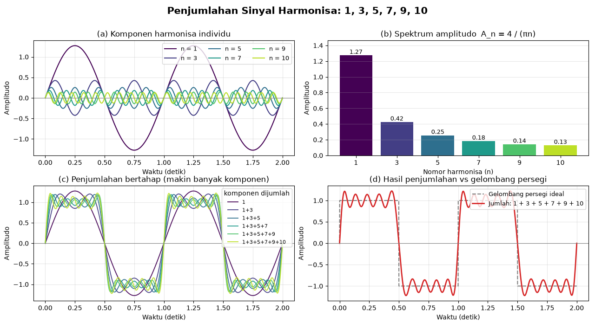

# Tugas Mata Kuliah Konsep Jaringan

## Tugas 1 — Analisis Alamat IP

| Kelas | Oktet pertama | Mask default | Bagian network |
|---|---|---|---|
| A | 1 – 126 | 255.0.0.0 (/8) | oktet 1 |
| B | 128 – 191 | 255.255.0.0 (/16) | oktet 1–2 |
| C | 192 – 223 | 255.255.255.0 (/24) | oktet 1–3 |

Langkah penghitungan:

1. Tentukan kelas dan mask dari oktet pertama.
2. **IP Network** = alamat dengan seluruh bit host bernilai 0.
3. **Broadcast** = alamat dengan seluruh bit host bernilai 1.
4. **Host pertama** = IP Network + 1.
5. **Host terakhir** = Broadcast − 1.
6. **IP Gateway** diambil dari host pertama.

**Hasil:**

| No | IP | Kelas / Mask | IP Network | IP Gateway = Host Pertama | Host Terakhir | Broadcast |
|---|---|---|---|---|---|---|
| 1 | 21.26.8.5 | A / 255.0.0.0 | 21.0.0.0 | 21.0.0.1 | 21.255.255.254 | 21.255.255.255 |
| 2 | 212.6.8.3 | C / 255.255.255.0 | 212.6.8.0 | 212.6.8.1 | 212.6.8.254 | 212.6.8.255 |
| 3 | 103.24.56.32 | A / 255.0.0.0 | 103.0.0.0 | 103.0.0.1 | 103.255.255.254 | 103.255.255.255 |
| 4 | 1.1.1.1 | A / 255.0.0.0 | 1.0.0.0 | 1.0.0.1 | 1.255.255.254 | 1.255.255.255 |
| 5 | 172.31.16.8 | B / 255.255.0.0 | 172.31.0.0 | 172.31.0.1 | 172.31.255.254 | 172.31.255.255 |


## Tugas 2 — Visualisasi Sinyal Harmonisa 1, 3, 5, 7, 9, 10

Sinyal periodik bisa disusun dari penjumlahan beberapa sinyal sinus yang frekuensinya kelipatan bulat dari frekuensi dasar f0. Sinyal-sinyal itu disebut **harmonisa**. Harmonisa ke-n punya frekuensi n × f0, dan amplitudonya mengecil sebesar 1/n:

Isi gambar
- Komponen individu. Setiap harmonisa (n = 1, 3, 5, 7, 9, 10) digambar sendiri. Makin besar n, gelombangnya makin rapat dan makin kecil.
- Spektrum amplitudo. Diagram batang amplitudo 4/(πn): 1,27 untuk n=1, lalu turun menjadi 0,42; 0,25; 0,18; 0,14; dan 0,13.
- Penjumlahan bertahap. Garis 1, lalu 1+3, lalu 1+3+5, dan seterusnya sampai semua komponen. Terlihat gelombangnya makin mendekati bentuk persegi.
- Hasil akhir. Jumlah semua komponen (merah) dibandingkan dengan gelombang persegi ideal (putus-putus abu-abu).

Program python sebagai berikut:

```python
import numpy as np
import matplotlib.pyplot as plt

HARMONISA = [1, 3, 5, 7, 9, 10]   
F0 = 1.0                          
PERIODE_TAMPIL = 2               

t = np.linspace(0, PERIODE_TAMPIL / F0, 2000)

def komponen(n, t):
    """Satu komponen harmonisa ke-n (amplitudo mengecil 1/n)."""
    return (4 / (np.pi * n)) * np.sin(2 * np.pi * n * F0 * t)

persegi_ideal = np.sign(np.sin(2 * np.pi * F0 * t))

semua_komponen = {n: komponen(n, t) for n in HARMONISA}

jumlah_bertahap = []        
total = np.zeros_like(t)
dipakai = []
for n in HARMONISA:
    total = total + semua_komponen[n]
    dipakai.append(str(n))
    jumlah_bertahap.append(("+".join(dipakai), total.copy()))

warna = plt.cm.viridis(np.linspace(0, 0.9, len(HARMONISA)))

fig, axs = plt.subplots(2, 2, figsize=(14, 8.5))
fig.suptitle("Penjumlahan Sinyal Harmonisa: " + ", ".join(map(str, HARMONISA)),
             fontsize=15, fontweight="bold")

ax = axs[0, 0]
for (n, y), c in zip(semua_komponen.items(), warna):
    ax.plot(t, y, color=c, lw=1.5, label=f"n = {n}")
ax.set_title("(a) Komponen harmonisa individu")
ax.set_xlabel("Waktu (detik)")
ax.set_ylabel("Amplitudo")
ax.axhline(0, color="gray", lw=0.8)
ax.legend(ncol=3, fontsize=9, loc="upper right")
ax.grid(alpha=0.3)

ax = axs[0, 1]
amplitudo = [4 / (np.pi * n) for n in HARMONISA]
bars = ax.bar([str(n) for n in HARMONISA], amplitudo, color=warna)
for b, a in zip(bars, amplitudo):
    ax.text(b.get_x() + b.get_width() / 2, a + 0.02, f"{a:.2f}",
            ha="center", fontsize=9)
ax.set_title("(b) Spektrum amplitudo  A_n = 4 / (πn)")
ax.set_xlabel("Nomor harmonisa (n)")
ax.set_ylabel("Amplitudo")
ax.set_ylim(0, max(amplitudo) * 1.15)
ax.grid(axis="y", alpha=0.3)

ax = axs[1, 0]
for (label, y), c in zip(jumlah_bertahap, warna):
    ax.plot(t, y, color=c, lw=1.4, alpha=0.9,
            label=f"{label}")
ax.set_title("(c) Penjumlahan bertahap (makin banyak komponen)")
ax.set_xlabel("Waktu (detik)")
ax.set_ylabel("Amplitudo")
ax.axhline(0, color="gray", lw=0.8)
ax.legend(fontsize=8, loc="upper right", title="komponen dijumlah")
ax.grid(alpha=0.3)

ax = axs[1, 1]
ax.plot(t, persegi_ideal, "--", color="gray", lw=1.5,
        label="Gelombang persegi ideal")
ax.plot(t, jumlah_bertahap[-1][1], color="#d62728", lw=2,
        label="Jumlah: " + " + ".join(map(str, HARMONISA)))
ax.set_title("(d) Hasil penjumlahan vs gelombang persegi")
ax.set_xlabel("Waktu (detik)")
ax.set_ylabel("Amplitudo")
ax.axhline(0, color="gray", lw=0.8)
ax.legend(fontsize=9, loc="upper right")
ax.grid(alpha=0.3)

plt.tight_layout(rect=[0, 0, 1, 0.96])
plt.savefig("visualisasi_harmonisa.png", dpi=150)
print("Gambar disimpan: visualisasi_harmonisa.png")
plt.show()
```

**Isi gambar yang dihasilkan:**


**Analisis hasil:**
* **Komponen Harmonisa Individu (a):** Sinyal dasar ($n=1$) memiliki amplitudo terbesar dan frekuensi terendah[cite: 1]. Seiring meningkatnya nomor harmonisa ($n$), gelombang menjadi semakin rapat (frekuensi tinggi) dengan amplitudo yang semakin mengecil[cite: 1].
* **Spektrum Amplitudo (b):** Mengikuti persamaan $A_n = \frac{4}{\pi n}$, nilai amplitudo mengalami penurunan tajam dari $n=1$ ($1{,}27$), $n=3$ ($0{,}42$), hingga $n=10$ ($0{,}13$)[cite: 1]. Hal ini membuktikan bahwa energi utama sinyal didominasi oleh harmonisa urutan rendah[cite: 1].
* **Penjumlahan Bertahap (c):** Penambahan komponen harmonisa ganjil secara berurutan ($1 \to 1+3 \to \dots \to 1+3+5+7+9+10$) membuat gelombang semakin curam saat transisi dan semakin mendatar di area puncak serta lembah[cite: 1].
* **Hasil Akhir vs Gelombang Persegi Ideal (d):** Gabungan seluruh sinyal memosisikan gelombang merah sangat mendekati gelombang persegi ideal (garis putus-putus abu-abu)[cite: 1]. Fluktuasi atau riak (*ripple*) pada bagian puncak terjadi karena jumlah komponen sinyal yang dijumlahkan masih terbatas[cite: 1].

## Tugas 3 — Subnetting

Lakukan pembagian subnet (*subnetting*) untuk setiap jaringan berikut:

1. `192.168.1.0/24` dibagi menjadi **4 subnet**
2. `132.10.0.0/16` dibagi menjadi **10 subnet**
3. `17.8.0.0/16` dibagi menjadi **4 subnet**
4. `8.32.0.0/12` dibagi menjadi **6 subnet**

**Tentukan untuk setiap subnet:**

- IP Network
- Subnet Mask (prefix baru)
- Host Pertama
- Host Terakhir
- Broadcast
- Jumlah host per subnet

**Rumus yang dipakai:**

- Jumlah bit yang dipinjam = n, dengan 2ⁿ ≥ jumlah subnet yang diminta.
- Prefix baru = prefix lama + n.
- Jumlah host per subnet = 2^(32 − prefix baru) − 2 (dikurangi alamat network dan alamat broadcast).
- Host pertama = IP Network + 1, host terakhir = Broadcast − 1.

### 3.1 — 192.168.1.0/24 dibagi 4 subnet

- Bit dipinjam: 2 (2² = 4), sehingga prefix baru **/26** dan subnet mask **255.255.255.192**.
- Ukuran blok 64 alamat, sehingga jumlah host per subnet = 2⁶ − 2 = **62**.

| Subnet | IP Network | Host Pertama | Host Terakhir | Broadcast |
|---|---|---|---|---|
| 1 | 192.168.1.0 | 192.168.1.1 | 192.168.1.62 | 192.168.1.63 |
| 2 | 192.168.1.64 | 192.168.1.65 | 192.168.1.126 | 192.168.1.127 |
| 3 | 192.168.1.128 | 192.168.1.129 | 192.168.1.190 | 192.168.1.191 |
| 4 | 192.168.1.192 | 192.168.1.193 | 192.168.1.254 | 192.168.1.255 |

### 3.2 — 132.10.0.0/16 dibagi 10 subnet

- Bit dipinjam: 4 (2⁴ = 16 ≥ 10), sehingga prefix baru **/20** dan subnet mask **255.255.240.0**.
- Ukuran blok 16 pada oktet ke-3, sehingga jumlah host per subnet = 2¹² − 2 = **4.094**.

| Subnet | IP Network | Host Pertama | Host Terakhir | Broadcast |
|---|---|---|---|---|
| 1 | 132.10.0.0 | 132.10.0.1 | 132.10.15.254 | 132.10.15.255 |
| 2 | 132.10.16.0 | 132.10.16.1 | 132.10.31.254 | 132.10.31.255 |
| 3 | 132.10.32.0 | 132.10.32.1 | 132.10.47.254 | 132.10.47.255 |
| 4 | 132.10.48.0 | 132.10.48.1 | 132.10.63.254 | 132.10.63.255 |
| 5 | 132.10.64.0 | 132.10.64.1 | 132.10.79.254 | 132.10.79.255 |
| 6 | 132.10.80.0 | 132.10.80.1 | 132.10.95.254 | 132.10.95.255 |
| 7 | 132.10.96.0 | 132.10.96.1 | 132.10.111.254 | 132.10.111.255 |
| 8 | 132.10.112.0 | 132.10.112.1 | 132.10.127.254 | 132.10.127.255 |
| 9 | 132.10.128.0 | 132.10.128.1 | 132.10.143.254 | 132.10.143.255 |
| 10 | 132.10.144.0 | 132.10.144.1 | 132.10.159.254 | 132.10.159.255 |

Dari 16 subnet /20 yang tersedia, 6 subnet belum terpakai: 132.10.160.0/20 sampai 132.10.240.0/20.

### 3.3 — 17.8.0.0/16 dibagi 4 subnet

- Bit dipinjam: 2 (2² = 4), sehingga prefix baru **/18** dan subnet mask **255.255.192.0**.
- Ukuran blok 64 pada oktet ke-3, sehingga jumlah host per subnet = 2¹⁴ − 2 = **16.382**.

| Subnet | IP Network | Host Pertama | Host Terakhir | Broadcast |
|---|---|---|---|---|
| 1 | 17.8.0.0 | 17.8.0.1 | 17.8.63.254 | 17.8.63.255 |
| 2 | 17.8.64.0 | 17.8.64.1 | 17.8.127.254 | 17.8.127.255 |
| 3 | 17.8.128.0 | 17.8.128.1 | 17.8.191.254 | 17.8.191.255 |
| 4 | 17.8.192.0 | 17.8.192.1 | 17.8.255.254 | 17.8.255.255 |

### 3.4 — 8.32.0.0/12 dibagi 6 subnet

- Blok /12 ini mencakup 8.32.0.0 sampai 8.47.255.255 (oktet ke-2 bernilai 32 sampai 47).
- Bit dipinjam: 3 (2³ = 8 ≥ 6), sehingga prefix baru **/15** dan subnet mask **255.254.0.0**.
- Ukuran blok 2 pada oktet ke-2, sehingga jumlah host per subnet = 2¹⁷ − 2 = **131.070**.

| Subnet | IP Network | Host Pertama | Host Terakhir | Broadcast |
|---|---|---|---|---|
| 1 | 8.32.0.0 | 8.32.0.1 | 8.33.255.254 | 8.33.255.255 |
| 2 | 8.34.0.0 | 8.34.0.1 | 8.35.255.254 | 8.35.255.255 |
| 3 | 8.36.0.0 | 8.36.0.1 | 8.37.255.254 | 8.37.255.255 |
| 4 | 8.38.0.0 | 8.38.0.1 | 8.39.255.254 | 8.39.255.255 |
| 5 | 8.40.0.0 | 8.40.0.1 | 8.41.255.254 | 8.41.255.255 |
| 6 | 8.42.0.0 | 8.42.0.1 | 8.43.255.254 | 8.43.255.255 |

Dari 8 subnet /15 yang tersedia, 2 subnet belum terpakai: 8.44.0.0/15 dan 8.46.0.0/15.

## Tugas 4 — Analisis Traceroute & Mekanisme TTL

### a. Pengertian dan fungsi Traceroute

**Traceroute** (di Windows bernama `tracert`) adalah utilitas diagnostik jaringan untuk menampilkan jalur yang dilalui paket dari komputer sumber sampai ke tujuan, router demi router. Setiap router yang dilewati disebut **hop**.

Fungsinya:

- Memetakan rute paket ke tujuan.
- Menemukan titik yang lambat, dengan membandingkan waktu tempuh (RTT) di tiap hop.
- Menemukan di hop mana paket berhenti atau tidak diteruskan saat koneksi bermasalah.
- Membantu memahami bagaimana jaringan dan routing bekerja.

### b. Pengertian dan fungsi TTL (Time To Live)

**TTL** adalah field 8 bit pada header IPv4, sehingga nilainya 0 sampai 255. Pada IPv6 field yang sama bernama **Hop Limit**. TTL berperan seperti jatah lompatan sebuah paket:

1. Pengirim mengisi nilai TTL awal. Nilai umum: Linux/macOS 64, Windows 128, perangkat Cisco 255.
2. Setiap router yang meneruskan paket mengurangi TTL sebesar 1.
3. Jika TTL mencapai 0, router membuang paket tersebut.
4. Router lalu mengirim pesan **ICMP Time Exceeded** kepada pengirim.

Fungsi utama TTL adalah mencegah paket berputar selamanya ketika terjadi **routing loop**, sekaligus membatasi jangkauan paket di jaringan.

### c. Bagaimana Traceroute memanfaatkan TTL

Traceroute sengaja mengirim paket dengan TTL yang sangat kecil supaya paket itu mati di router tertentu. Router yang membuangnya akan mengirim pesan Time Exceeded yang memuat alamat IP router tersebut. TTL dinaikkan satu per satu sehingga tiap probe mencapai satu hop lebih jauh:

| Probe | TTL | Yang terjadi |
|---|---|---|
| 1 | 1 | Paket mati di router ke-1, yang membalas Time Exceeded |
| 2 | 2 | Lolos router ke-1, mati di router ke-2 |
| 3 | 3 | Lolos router ke-1 dan ke-2, mati di router ke-3 |
| ... | ... | ... |
| N | N | Paket sampai di tujuan, tujuan membalas dengan pesan lain |

Traceroute mengirim 3 probe untuk tiap nilai TTL, sehingga ada tiga nilai RTT per hop. Batas default adalah 30 hop.

### d. Peran ICMP dalam Traceroute

**ICMP (Internet Control Message Protocol)** adalah protokol pada layer Internet yang membawa pesan kontrol dan pesan error, bukan data aplikasi. Traceroute bergantung pada pesan ICMP untuk mengetahui hasil tiap probe:

| Pesan ICMP | Type / Code | Dikirim oleh | Fungsi dalam Traceroute |
|---|---|---|---|
| Time Exceeded | 11 / 0 | Router yang menurunkan TTL menjadi 0 | Memberi tahu sumber alamat router di hop tersebut |
| Echo Request | 8 | Sumber (probe `tracert` Windows) | Paket probe |
| Echo Reply | 0 | Tujuan | Tanda sudah sampai di tujuan (Windows) |
| Port Unreachable | 3 / 3 | Tujuan | Tanda sudah sampai di tujuan (Linux) |

Perbedaan sistem operasi: `tracert` Windows memakai probe ICMP Echo Request. `traceroute` Linux/macOS secara default memakai probe **UDP** ke port tinggi yang tidak dipakai (mulai 33434), sehingga tujuan membalas Port Unreachable. Linux juga bisa memakai ICMP lewat `traceroute -I` atau TCP lewat `traceroute -T`.

### e. Contoh alur kerja dari sumber ke tujuan

Misalkan jalurnya: **PC → Router A → Router B → Router C → Server tujuan**.

1. **Probe 1 (TTL = 1).** Router A mengurangi TTL menjadi 0, membuang paket, lalu mengirim ICMP Time Exceeded ke PC. PC mencatat hop 1 = Router A beserta RTT-nya.
2. **Probe 2 (TTL = 2).** Router A mengurangi TTL menjadi 1 dan meneruskan paket. Router B mengurangi TTL menjadi 0, membuang paket, dan mengirim Time Exceeded. PC mencatat hop 2 = Router B.
3. **Probe 3 (TTL = 3).** Router A dan B mengurangi TTL menjadi 2 lalu 1. Router C menurunkannya menjadi 0, membuang paket, dan melapor. PC mencatat hop 3 = Router C.
4. **Probe 4 (TTL = 4).** Paket lolos ketiga router dan tiba di server dengan TTL = 1. Server adalah host akhir, bukan router, jadi paket diproses dan server membalas dengan Echo Reply (ICMP) atau Port Unreachable (UDP). Traceroute tahu tujuan sudah tercapai dan berhenti.

Contoh tampilan hasilnya (alamat IP hanya ilustrasi):

```
traceroute to example.com (93.184.216.34), 30 hops max, 60 byte packets
 1  192.168.1.1      1.8 ms   1.6 ms   1.9 ms
 2  10.20.0.1        8.4 ms   8.1 ms   9.0 ms
 3  * * *
 4  72.14.215.85    25.3 ms  24.9 ms  25.7 ms
 5  93.184.216.34   31.2 ms  30.8 ms  31.0 ms
```

Cara membaca: angka paling kiri adalah nomor hop (nilai TTL), lalu alamat IP router yang membalas, lalu tiga nilai RTT. Tanda `* * *` berarti tidak ada balasan pada hop itu. Itu belum tentu putus, karena hop berikutnya tetap menjawab. Penyebabnya bisa firewall atau router yang dibatasi untuk membalas ICMP.

### f. Keterbatasan dan kesimpulan

- Jalur bisa berubah antar-probe karena load balancing, dan jalur pulang bisa berbeda dari jalur pergi.
- RTT tinggi di satu hop belum tentu berarti jaringan lambat, karena router memberi prioritas rendah pada balasan ICMP.
- **Kesimpulan:** TTL membatasi umur paket dan membuat router yang membuangnya mengirim ICMP Time Exceeded. Traceroute memanfaatkan hal ini dengan menaikkan TTL satu per satu, sehingga identitas setiap router di sepanjang jalur terungkap sampai tujuan tercapai.

## Tugas 5 — Subnetting VLSM

Sebuah kampus memiliki alokasi jaringan **10.252.108.0/24** yang akan dibagi untuk **empat segmen** dengan kebutuhan host sebagai berikut:

| Segmen | Kebutuhan Host |
|--------|----------------|
| Laboratorium A | 90 host |
| Laboratorium B | 60 host |
| Administrasi | 14 host |
| Tautan Point-to-Point | 4 endpoint |

**Tentukan untuk setiap segmen:**

- IP Network
- Subnet Mask (prefix baru)
- Host Pertama
- Host Terakhir
- Broadcast
- Jumlah host yang tersedia
- Sisa alokasi IP yang belum terpakai (jika ada)

Alokasi: **10.252.108.0/24** (256 alamat). Pada VLSM, setiap segmen mendapat blok yang ukurannya pas dengan kebutuhannya. Rumusnya: pilih blok terkecil 2ᵏ dengan 2ᵏ ≥ kebutuhan host + 2 (alamat network dan broadcast). Alokasi dimulai dari kebutuhan terbesar supaya blok tersusun rapat dan tidak tumpang tindih.

**Langkah 1 — menentukan ukuran blok:**

| Segmen | Kebutuhan host | Dibutuhkan (host + 2) | Blok terkecil | Prefix | Host tersedia |
|---|---|---|---|---|---|
| Laboratorium A | 90 | 92 | 128 (2⁷) | /25 | 126 |
| Laboratorium B | 60 | 62 | 64 (2⁶) | /26 | 62 |
| Administrasi | 14 | 16 | 16 (2⁴) | /28 | 14 |
| Tautan Point-to-Point | 4 endpoint | 6 | 8 (2³) | /29 | 6 |

Pada tautan point-to-point, blok /30 hanya memuat 2 host, sehingga untuk **4 endpoint** dibutuhkan /29.

**Langkah 2 — hasil alokasi:**

| Segmen | IP Network | Prefix / Subnet Mask | Host Pertama | Host Terakhir | Broadcast | Host Tersedia |
|---|---|---|---|---|---|---|
| Laboratorium A | 10.252.108.0 | /25 — 255.255.255.128 | 10.252.108.1 | 10.252.108.126 | 10.252.108.127 | 126 |
| Laboratorium B | 10.252.108.128 | /26 — 255.255.255.192 | 10.252.108.129 | 10.252.108.190 | 10.252.108.191 | 62 |
| Administrasi | 10.252.108.192 | /28 — 255.255.255.240 | 10.252.108.193 | 10.252.108.206 | 10.252.108.207 | 14 |
| Tautan Point-to-Point | 10.252.108.208 | /29 — 255.255.255.248 | 10.252.108.209 | 10.252.108.214 | 10.252.108.215 | 6 |

**Sisa alokasi yang belum terpakai:** 10.252.108.216 sampai 10.252.108.255, yaitu **40 alamat**. Sisa ini bisa dinyatakan sebagai dua blok: 10.252.108.216/29 (8 alamat) dan 10.252.108.224/27 (32 alamat). Total alamat terpakai 128 + 64 + 16 + 8 = 216 dari 256 (sekitar 84,4%).
